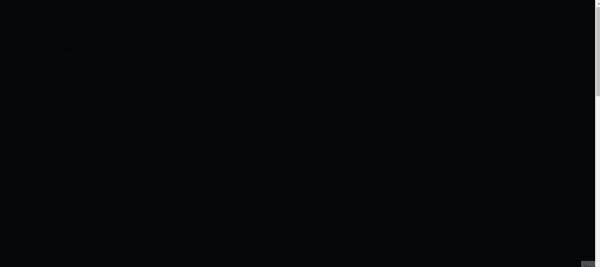
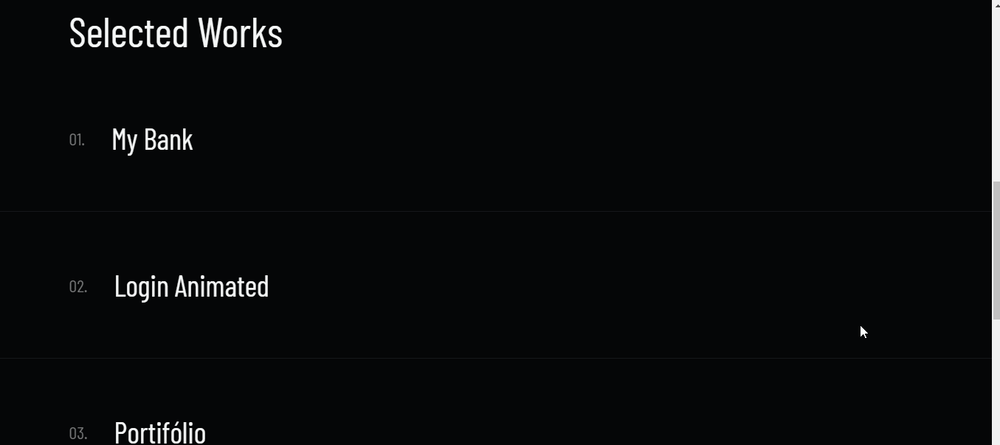

# Projeto FrontWeek

## 🚀 Tecnologias

Esse projeto foi desenvolvido com as seguintes tecnologias:

- HTML
- SASS
- GSAP
- JavaScript

 

## 💻 Projeto

Este projeto foi desenvolvido na FrontWeek, orientado por Násser Yousef Ali, desde o conceito de UI até a codificação do projeto.

 

## 🔖 Layout Responsivo ✔️

 
Feito com 🖤 por Gabriel Cavalheiro.